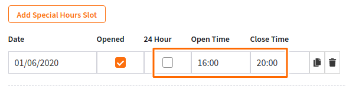
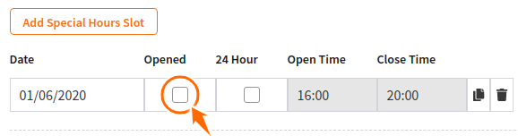

# Change opening hours for specific dates

1. Log in to your account at [https://admin.booknorder.co.nz](https://admin.booknorder.co.nz/)
2. Open your restaurant dashboard and go to the "**Settings**" page
3.  Click the "**System**" tab and then "**Opening Hours**"\

    

    <figure><figcaption></figcaption></figure>

    

4. Go down to the "Special Hours" section and click "**Add Special Hours Slot**"
5.  Click on the date cell to select to open the calendar and select a date\
    \

    

    <figure><figcaption></figcaption></figure>

    

6. Then do one of the following:
   1.  Define "**Open"** and "**Close"** times for that date...\

       

       <figure><figcaption></figcaption></figure>

       

       **OR**\

   2.  Uncheck the "**Opened**" checkbox, if you want your store to be closed on that day\

       

       <figure><figcaption></figcaption></figure>

       

7.  Don't forget to click "**Save**" to update the settings\
    \

    

    <figure><figcaption></figcaption></figure>

    

