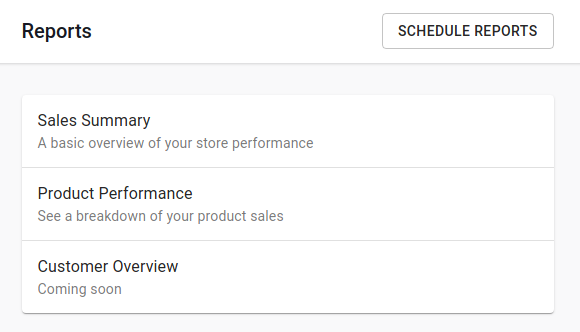

# How to view your reports


Note: If you cannot see the "Reports" button below, please contact us as your account may not have the necessary permissions.


Reporting is an important aspect of running a business. To view your reports you must:

1. Visit [https://admin.booknorder.co.nz](https://admin.booknorder.co.nz/) and log-in to your account
2.  On the left navbar, press the "Reports" button\

    <figure><figcaption></figcaption></figure>
3.  Select the report you would like to view on the next page\

    <figure><figcaption></figcaption></figure>

### Filtering Your Report

To filter the report by different time periods, use the "Filter" button on the top right corner of the reports page

\
\

\
